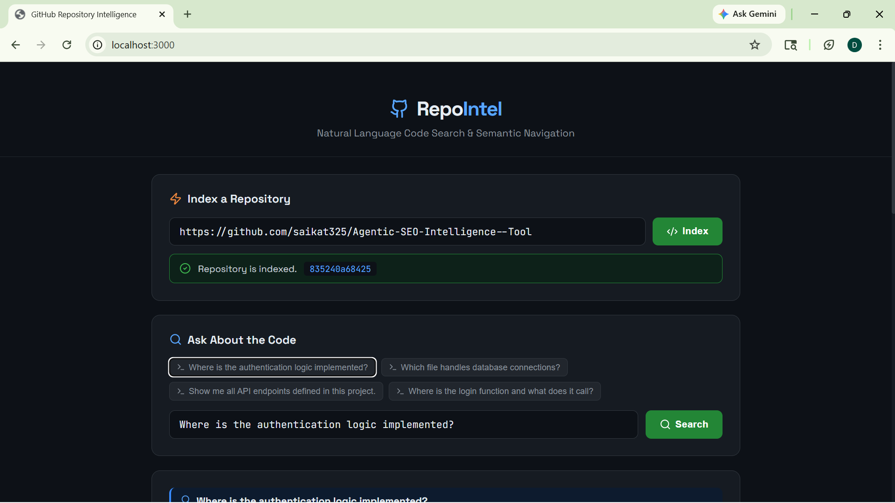
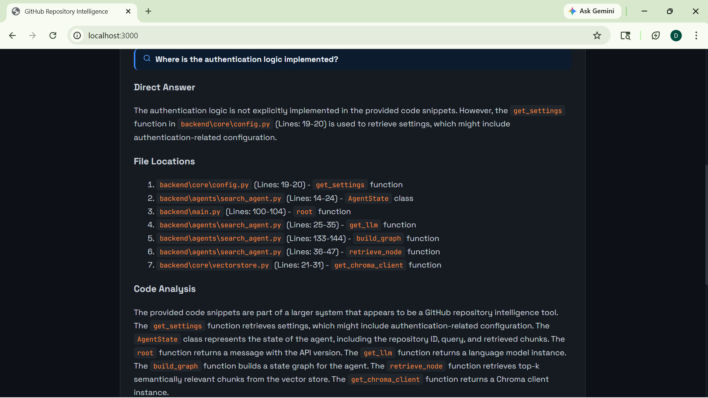
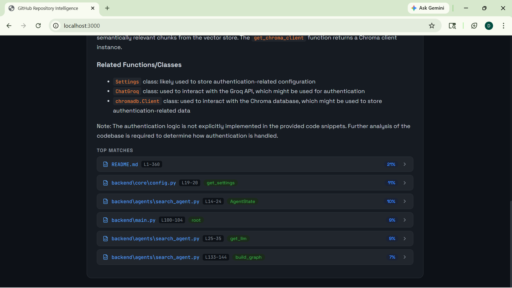

# 🔍 GitHub Repository Intelligence Tool

> An AI-powered pipeline that ingests any public GitHub repository and lets you ask natural language questions about the codebase — returning exact file paths, line numbers, function names, and code snippets.

---

## 4.1 Project Title & One-Liner Description

**GitHub Repository Intelligence Tool** — A semantic code search engine that understands any GitHub repository and answers natural language questions about it with precise file locations, line numbers, and contextual code snippets.

---

## 4.2 Thought Process & Approach

### First Understanding of the Problem

When I first read the assignment, I identified this as a **Retrieval-Augmented Generation (RAG) problem applied to source code**. The core challenge is not just "search" — it is *semantic understanding* of code. A developer asking "where is the authentication logic?" might not use the word "auth" at all in their code — they might use `verify_token`, `check_credentials`, or `passport.js`. A keyword search would fail. Only a semantic embedding approach can bridge that gap.

**Constraints I identified immediately:**
- The tool must work on *any* public GitHub repository — I cannot assume language, structure, or size.
- Results must be precise: file path + line number + snippet, not generic summaries.
- It must run on a fresh machine with minimal setup — so dependencies must be manageable.
- No git executable should be required (Windows compatibility issue discovered during development).

### Approaches Considered

**Approach 1: Simple grep/keyword search**
Rejected immediately. Keyword search cannot handle semantic queries like "where is the login logic" if the function is named `authenticate_user`. It also cannot rank results by relevance.

**Approach 2: Send entire repo to LLM as context**
Considered briefly. Works for tiny repos but fails completely on any real-world codebase — token limits make it impossible. A 10,000-line repo would exceed any LLM's context window.

**Approach 3: Vector embeddings + RAG (chosen approach)**
This is the correct architecture for this problem. The idea:
- Chunk the codebase into semantically meaningful pieces (anchored to function/class boundaries)
- Embed each chunk using a sentence transformer model
- Store embeddings in a vector database (ChromaDB)
- At query time, embed the question, find the most similar chunks, then pass those chunks to an LLM for a precise, structured answer

This approach scales to any repo size, handles semantic queries naturally, and returns grounded answers (the LLM only sees real code from the repo — it cannot hallucinate file names).

### Why LangGraph for the Agent?

I chose **LangGraph** over a simple LangChain chain because the pipeline has discrete, stateful steps: `retrieve → analyse`. LangGraph makes each node explicit and independently testable. It also makes it easy to add future nodes (e.g., a re-ranking node, or a follow-up query node) without restructuring the entire pipeline.

### Tradeoffs Made

| Decision | Tradeoff |
|---|---|
| Symbol-aware chunking over sliding window | More accurate chunk boundaries, but regex-based — may miss edge cases in unusual code styles |
| `all-MiniLM-L6-v2` embedding model | Fast and lightweight (90MB), but less powerful than larger models like `text-embedding-3-large` |
| ChromaDB local persistence | Zero infrastructure needed, but not suitable for multi-user concurrent deployments |
| Groq (LLaMA-3 70B) as LLM | Free, extremely fast inference — but dependent on Groq API availability |
| GitHub ZIP download over git clone | No git executable required (critical for Windows) — but cannot do incremental updates |
| `top_k=15` retrieval | More context for the LLM, better answers — but slightly slower query time |

### What Did Not Work

**Attempt: Using tree-sitter for AST-based chunking**
I initially planned to use `tree-sitter` to parse code into proper AST nodes (functions, classes) for perfect chunk boundaries. This failed because tree-sitter requires compiled language grammars that are difficult to install reliably across Windows/Mac/Linux without a C compiler. I replaced it with regex-based symbol detection which works reliably across all platforms with zero native dependencies.

**Attempt: Sending full file content to LLM**
Early testing showed that when I sent entire files to the LLM, it would get confused by irrelevant code and produce worse answers than when I sent only the top retrieved chunks. Focused context = better answers.

---

## 4.3 Architecture Diagram

### High-Level Pipeline Flow

```
┌─────────────────────────────────────────────────────────────────────┐
│                        USER (React JS Frontend)                      │
│                     http://localhost:3000                            │
└───────────────────────────┬─────────────────────────────────────────┘
                            │  GitHub URL  /  Natural Language Query
                            ▼
┌─────────────────────────────────────────────────────────────────────┐
│                    FastAPI Backend  (main.py)                        │
│                     http://localhost:8000                            │
│                                                                      │
│   POST /ingest  ──►  Background Indexing Job                        │
│   GET  /status  ──►  Job Status Polling                             │
│   POST /query   ──►  LangGraph Agent Pipeline                       │
│   GET  /search  ──►  Raw Semantic Search (debug)                    │
└──────┬──────────────────────────────────────────┬───────────────────┘
       │                                          │
       ▼  INGESTION PIPELINE                      ▼  QUERY PIPELINE
       │                                          │
┌──────┴──────────────┐                  ┌────────┴──────────────────┐
│  core/ingestion.py  │                  │  agents/search_agent.py   │
│                     │                  │   (LangGraph Agent)        │
│  1. Parse GitHub URL│                  │                            │
│  2. Download ZIP    │                  │  Node 1: retrieve_node     │
│     via urllib      │                  │  └─► vectorstore.py        │
│  3. Extract to      │                  │      semantic_search()     │
│     /repos/{id}/    │                  │      top_k=15 chunks       │
└──────┬──────────────┘                  │                            │
       │                                 │  Node 2: analyse_node      │
       ▼                                 │  └─► Groq API              │
┌──────┴──────────────┐                  │      LLaMA-3 70B           │
│  core/chunker.py    │                  │      structured answer     │
│                     │                  └────────┬──────────────────┘
│  1. Walk all files  │                           │
│  2. Symbol-aware    │                           ▼
│     chunking        │                  ┌────────┴──────────────────┐
│     (fn/class       │                  │        RESPONSE            │
│      boundaries)    │                  │                            │
│  3. Sliding window  │                  │  {                         │
│     fallback        │                  │    answer: "markdown...",  │
└──────┬──────────────┘                  │    results: [              │
       │                                 │      {                     │
       ▼                                 │        file_path,          │
┌──────┴──────────────┐                  │        start_line,         │
│  core/vectorstore.py│                  │        end_line,           │
│                     │                  │        symbol_name,        │
│  1. Embed chunks    │                  │        score,              │
│     sentence-       │                  │        snippet             │
│     transformers    │                  │      }                     │
│     all-MiniLM-L6   │                  │    ]                       │
│  2. Store in        │                  │  }                         │
│     ChromaDB        │                  └────────┬──────────────────┘
│     (cosine sim)    │                           │
└─────────────────────┘                           ▼
                                        ┌─────────┴──────────────────┐
                                        │   React JS Frontend         │
                                        │                             │
                                        │  • Markdown answer rendered │
                                        │  • Expandable code snippets │
                                        │  • File path + line numbers │
                                        │  • Similarity scores        │
                                        └────────────────────────────┘
```

### File-by-File Data Flow (GitHub URL → Answer)

```
User pastes GitHub URL
        │
        ▼
[main.py]  POST /ingest
  └── calls ingestion.py::clone_repository()
        │
        ▼
[core/ingestion.py]
  ├── parse_github_url()     → extracts owner + repo name
  ├── get_repo_id()          → generates stable MD5 hash ID
  └── _download_zip()        → downloads ZIP from GitHub API
        │  extracted to /repos/{repo_id}/
        ▼
[core/ingestion.py]  walk_files()
  └── walks all files, filters by extension + size
        │  returns list of {path, content, lines, extension}
        ▼
[core/chunker.py]  chunk_file()
  ├── extract_symbols()      → regex finds def/class/func boundaries
  └── symbol-aware chunks    → each chunk anchored to a function/class
        │  returns list of {text, file_path, start_line, end_line, symbol_name}
        ▼
[core/vectorstore.py]  index_chunks()
  ├── SentenceTransformer    → embeds each chunk to 384-dim vector
  └── ChromaDB.add()         → persists vectors + metadata locally
        │
        ▼
[main.py]  status → "ready"   ← User polls this

━━━━━━━━━━━━━━━━━━━━━━━━━━━━━━━━━━━━━━━

User types natural language question
        │
        ▼
[main.py]  POST /query
  └── calls search_agent.py::run_query()
        │
        ▼
[agents/search_agent.py]  LangGraph Graph
  │
  ├── Node 1: retrieve_node()
  │     └── vectorstore.py::semantic_search()
  │           ├── embed query → 384-dim vector
  │           ├── ChromaDB.query() → cosine similarity
  │           └── returns top 15 most similar chunks
  │
  └── Node 2: analyse_node()
        ├── builds context from 12 best chunks
        ├── strict system prompt (no hallucination rules)
        └── Groq API → LLaMA-3 70B → structured markdown answer
              │
              ▼
        {answer, results[{file_path, lines, symbol, score, snippet}]}
              │
              ▼
[React JS Frontend]
  └── renders markdown + expandable code cards with syntax highlighting
```

---

## Tech Stack

| Layer | Technology | Purpose |
|---|---|---|
| **Backend Framework** | FastAPI | REST API, async background jobs, CORS |
| **Agent Orchestration** | LangGraph | Stateful retrieve → analyse pipeline |
| **LLM** | Groq API (LLaMA-3 70B) | Fast inference for code analysis |
| **LLM Integration** | LangChain + langchain-groq | LLM abstraction layer |
| **Embeddings** | sentence-transformers (all-MiniLM-L6-v2) | Semantic vector embeddings |
| **Vector Database** | ChromaDB | Local persistent vector store |
| **Repo Ingestion** | Python urllib (built-in) | GitHub ZIP download, no git required |
| **Code Chunking** | Custom regex-based chunker | Symbol-aware code splitting |
| **Frontend** | React JS | Web UI with syntax highlighting |
| **Config Management** | pydantic-settings | Environment variable management |
| **API Server** | Uvicorn | ASGI server for FastAPI |

---

## 4.4 Setup & Installation

### Prerequisites

- Python 3.10 or higher
- Node.js 18+ (for React frontend only)
- A free Groq API key → [console.groq.com](https://console.groq.com)

### Step 1 — Clone the Repository

```bash
git clone 
cd github-intel
```

### Step 2 — Backend Setup

```bash
cd backend

# Create and activate virtual environment
python -m venv venv

# On Windows:
venv\Scripts\activate

# On Mac/Linux:
source venv/bin/activate

# Install dependencies
pip install -r requirements.txt
```

### Step 3 — Configure Environment

```bash
cp .env.example .env
```

Open `.env` and set your Groq API key:

```
GROQ_API_KEY=gsk_your_key_here
```

### Step 4 — Start the Backend

```bash
uvicorn main:app --host 0.0.0.0 --port 8000 --reload
```

Backend runs at: `http://localhost:8000`  
API docs (Swagger UI): `http://localhost:8000/docs`

### Step 5 — Start the Frontend (React JS)

Open a **new terminal**:

```bash
cd frontend
npm install
npm start
```

Frontend opens at: `http://localhost:3000`


---

## 4.5 Usage Examples
**Query:** *"Where is the authentication logic implemented?"*
> This test proves the tool can navigate complex agentic logic across files.
<br/>
<div align="center">

  
  <br/>
  
  <br/>
  
</div>

---

## 4.6 Limitations & Future Work

### Current Limitations

- **Binary and minified files are skipped** — The tool cannot analyse compiled code, minified JS bundles, or binary assets. Only source files with supported extensions are indexed.

- **Very large repositories are slow to index** — A repo with 1,000+ files and 100,000+ lines of code will take several minutes to embed and index. There is no progress streaming to the frontend during this time.

- **Regex-based chunking is imperfect** — Symbol detection uses regular expressions, not a proper AST parser. Unusual code styles (e.g., single-line class definitions, decorators, metaprogramming) may cause chunk boundaries to be slightly off.

- **No incremental re-indexing** — If the repository is updated, the entire repo must be re-indexed from scratch. There is no diff-based update mechanism.

- **In-memory job tracking** — The background indexing job status is stored in memory. If the backend restarts mid-indexing, the job status is lost (though ChromaDB data persists on disk).

- **Single-user architecture** — ChromaDB in local persistent mode is not designed for concurrent multi-user writes. This would need a hosted vector DB for production.

- **Groq API dependency** — The tool requires an active internet connection and Groq API availability. If the Groq API is down, queries fail.

### Future Improvements

- **AST-based chunking** — Replace regex with `tree-sitter` for language-aware, syntactically perfect chunk boundaries across all supported languages.

- **Re-ranking step** — Add a cross-encoder re-ranking node in the LangGraph pipeline to improve result ordering after initial retrieval.

- **Streaming responses** — Stream the LLM answer token-by-token to the frontend for a better UX (FastAPI supports SSE/WebSockets).

- **Private repository support** — Accept a GitHub personal access token to index private repositories.

- **Multi-repo search** — Allow querying across multiple indexed repositories simultaneously.

- **Incremental indexing** — Track file hashes and only re-embed files that have changed since the last index.

- **Hosted vector database** — Replace local ChromaDB with Pinecone or Weaviate for production-scale multi-user deployment.

- **IDE plugin** — Package the query interface as a VS Code extension so developers can query the codebase without leaving their editor.

---

## Project Structure

```
github-intel/
├── backend/
│   ├── agents/
│   │   ├── __init__.py
│   │   └── search_agent.py      ← LangGraph agent (retrieve + analyse nodes)
│   ├── core/
│   │   ├── __init__.py
│   │   ├── config.py            ← pydantic-settings environment config
│   │   ├── ingestion.py         ← GitHub ZIP download + file walker
│   │   ├── chunker.py           ← Symbol-aware code chunker
│   │   └── vectorstore.py       ← ChromaDB + sentence-transformers
│   ├── main.py                  ← FastAPI app (all API routes)
│   ├── requirements.txt
│   ├── Dockerfile
│   └── .env.example
├── frontend/
│   ├── src/
│   │   ├── App.js               ← Main React UI component
│   │   ├── index.js
│   │   └── hooks/api.js         ← Axios API calls
│   ├── public/index.html
│   ├── package.json
│   └── Dockerfile
├── docker-compose.yml
└── README.md
```

---
